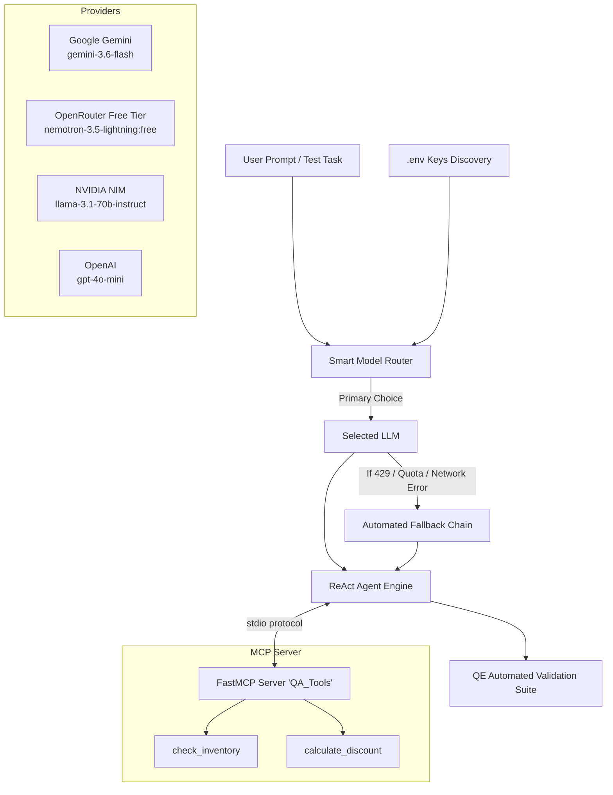

# 🤖 Enterprise Agent QE & MCP Framework with Smart Multi-Provider Routing

A production-ready **AI Agent Quality Engineering (QE) & Testing Framework** built with **LangGraph**, **Model Context Protocol (MCP)**, and an **Intelligent Multi-Provider Model Router** supporting zero-downtime automated fallbacks across **Google Gemini, OpenRouter, NVIDIA NIM, and OpenAI**.

---

## 🏗️ Architecture



---

## ✨ Key Features

1. **Standardized Tool Protocol (MCP)**:
   - Built on `FastMCP` and `langchain-mcp-adapters` to expose business tools (`check_inventory`, `calculate_discount`) over stdio.
   - Fully decoupled from agent logic, allowing dynamic tool discovery.

2. **Smart Multi-Provider Model Router**:
   - Auto-discovers available API keys in `.env`.
   - Estimates token requirements and routes tasks to the most cost-effective and capable model.
   - Built-in **zero-downtime fallback**: If Google Gemini encounters a rate limit (429), it automatically cascades to NVIDIA NIM, OpenRouter, or OpenAI without dropping the execution.

3. **Agent Quality Engineering (QE) Test Suite**:
   - **Tool Selection Testing**: Validates that the agent picks the correct tool for specific intents.
   - **Parameter Extraction**: Ensures exact numerical and string arguments are extracted.
   - **Trajectory Validation**: Verifies multi-step tool call sequences and reasoning chains.
   - **Security & Negative Testing**: Enforces policy guardrails against prompt injections (e.g., unauthorized 100% discount requests) and out-of-domain queries.
   - **Visual Reports**: Generates self-contained HTML test reports (`report.html`) and Allure test artifacts (`allure-results/`).

---

## 🚀 Quickstart

### 1. Clone & Setup Environment

```bash
git clone https://github.com/poornaai2026/QE2AI.git
cd QE2AI
git checkout feature/smart-model-router-and-mcp-agent
```

Create a virtual environment and install dependencies:

```bash
python -m venv venv
# On Windows:
.\venv\Scripts\activate
# On Linux/macOS:
source venv/bin/activate

pip install -r requirements.txt
```

### 2. Configure Environment Variables

Copy the example configuration:

```bash
cp .env.example .env
```

Add your API keys to `.env` (at least one is required):
```env
GOOGLE_API_KEY=your_google_gemini_api_key
OPEN_ROUTER_API_KEY=your_openrouter_api_key
NVIDIA_API_KEY=your_nvidia_api_key
OPENAI_API_KEY=your_openai_api_key
```

---

## 🏃 Running the Agent

Run the main agent to see MCP tool calling and smart routing in action:

```bash
python agent.py
```

---

## 🧪 Running the QE Test Suite

### Run All Tests with HTML & Allure Reporting:

```bash
pytest tests/ -v --alluredir=allure-results --html=report.html --self-contained-html
```

- **HTML Report**: Open `report.html` in any browser to inspect test results and execution timings.
- **Allure Report**: View comprehensive test steps and attachments via `allure serve allure-results`.

---

## 📁 Repository Structure

```
├── agent.py               # ReAct Agent orchestrator with MCP client & security guardrails
├── router.py              # Smart Model Router with dynamic fallback chaining
├── mcp_server.py          # FastMCP server exposing QA tools via stdio
├── requirements.txt       # Pinned, conflict-free project dependencies
├── .env.example           # Configuration template
├── .gitignore             # Secrets & artifacts ignore rules
└── tests/
    ├── conftest.py        # Async test fixtures and event loop setup
    ├── test_tools.py      # Tool selection and parameter extraction tests
    ├── test_trajectory.py # Multi-step agent execution validation
    ├── test_negative.py   # Prompt injection resilience & out-of-domain tests
    ├── test_evals.py      # LLM answer relevancy evaluations (DeepEval)
    └── test_rag.py        # RAG metric evaluations (Ragas)
```
