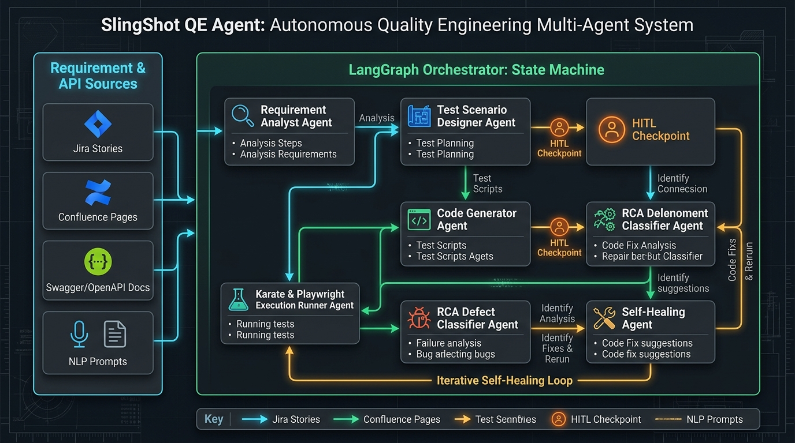
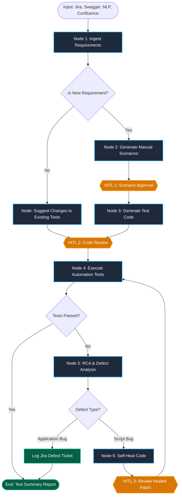

# Walkthrough: SlingShot QE Autonomous Multi-Agent Framework

This document outlines the architecture, implementation, and verification of the **SlingShot Quality Engineering (QE) Multi-Agent Framework** for automated API and UI testing, powered by **LangGraph**, **LangChain**, and Python.

---

## 1. Deep Agents vs. Normal Agents: Conceptual & Practical Breakdown

The system implements a **Hierarchical Multi-Agent Graph (LangGraph StateGraph)** rather than a simple single ReAct ("normal") agent:

| Capability | Single ReAct ("Normal") Agent | Hierarchical Multi-Agent Graph (LangGraph) |
| :--- | :--- | :--- |
| **Workflow Scope** | Single prompt with all tools; suffers from context bloat and hallucination. | **Specialist sub-agents** for each distinct phase (Requirement Analyst, Scenario Designer, Code Writer, Execution Engine, RCA & Self-Healer). |
| **Human-In-The-Loop (HITL)** | Struggles to cleanly pause, persist state across days/sessions, and resume. | Built-in via LangGraph **Checkpointers** (`MemorySaver`) and **`interrupt()`** at every critical review gate. |
| **Deterministic Branching** | Unreliable; LLM can skip scenario generation or misroute new vs. existing test suites. | **Conditional edges** (`is_new_requirement`, `failure_due_to_script`, `healing_attempts < max`). |
| **Self-Healing Loop** | Prone to infinite loops and context saturation during iterative fixes. | Controlled state cycle with counter thresholds, diff-based state updates, and human approval before re-run. |

---

## 2. Complete Workflow Diagram

### Architecture Diagram


### Interactive Flowchart (Mermaid)



### ASCII Logic Diagram

```
                   [Input Prompt / Jira / Swagger / Confluence]
                                        │
                                        ▼
                            [Ingest Requirements]
                                        │
                     Is New Requirement? (Conditional Edge)
                      ├── Yes ─────────────────── No ──┐
                      ▼                                ▼
            [Generate Scenarios]              [Suggest Changes]
                      │                                │
                   [HITL 1]                            │
                      │                                │
                      ▼                                │
            [Generate Test Code]                       │
                      │                                │
                   [HITL 2]                            │
                      │                                │
                      └────────────────┬───────────────┘
                                       ▼
                             [Execute Automation] (Karate API / Playwright UI)
                                       │
                                       ▼
                            [Defect Analysis & RCA]
                                       │
                           Failure due to Script?
                            ├── Yes ────────────── No / Passed ──────> [End / Report]
                            ▼
                    [Self-Heal Code]
                            │
                         [HITL 3]
                            │
                            └──> (Loop back to Execute Automation)
```

---

## 3. Step-by-Step Execution Flow (Learner's Deep Dive)

For any engineer or learner trying to understand how this system operates, here is the complete end-to-end journey of an execution:

```
┌─────────────────────────────────────────────────────────────────────────────────────────────┐
│                                    THE LIFE OF A QE RUN                                     │
└─────────────────────────────────────────────────────────────────────────────────────────────┘

  1. TRIGGER & INGESTION
     User triggers: python cli.py --type api --source swagger -i examples/sample_swagger.json
     │
     ▼
  2. NODE: `ingest_requirements`
     ├── Parses OpenAPI / Swagger specification into endpoint schemas.
     ├── WorkspaceContextTool scans `workspace/tests/` for existing test suites.
     └── Classifies requirement:
         - Brand New Feature?  ──> Routes to `generate_scenarios`
         - Existing Test Update? ──> Routes to `suggest_changes`
     │
     ▼
  3. NODE: `generate_scenarios`
     ├── ScenarioAgent synthesizes manual BDD test cases:
     │   • Positive (Happy Path: valid payload, expected 200/201)
     │   • Negative (Validation: missing required attributes, expected 400)
     │   • Security (Authentication: missing bearer token, expected 401)
     └── Saves scenarios to `state["manual_scenarios"]`.
     │
     ▼
  4. CHECKPOINT: `hitl_scenario_approval` [HITL Gate 1]
     ├── LangGraph pauses execution using `interrupt()`.
     ├── State snapshot is saved to `MemorySaver` (or Postgres in prod).
     ├── Terminal renders an interactive scenario table:
     │   ┌─────────────┬─────────────────────────────────┬──────────┬─────────────────┐
     │   │ ID          │ Title                           │ Type     │ Expected Result │
     │   ├─────────────┼─────────────────────────────────┼──────────┼─────────────────┤
     │   │ TC-API-001  │ Positive: Create resource       │ positive │ Status 201      │
     │   │ TC-API-002  │ Negative: Missing required field│ negative │ Status 400      │
     │   │ TC-API-003  │ Security: Unauthorized request  │ security │ Status 401      │
     │   └─────────────┴─────────────────────────────────┴──────────┴─────────────────┘
     └── Human Reviewer Options:
         - "approve" -> Graph resumes with `Command(resume={"status": "approved"})`
         - "modify"  -> Human enters feedback to refine scenarios
         - "reject"  -> Execution terminates safely
     │
     ▼
  5. NODE: `generate_code`
     ├── CodeGenAgent translates approved scenarios into executable code:
     │   • If API: writes Karate DSL (`api_orders_test.feature`)
     │   • If UI:  writes Playwright Python (`test_ui_workflow.py`)
     └── WorkspaceContextTool writes the file directly to `workspace/tests/`.
     │
     ▼
  6. CHECKPOINT: `hitl_code_approval` [HITL Gate 2]
     ├── LangGraph pauses via `interrupt()`.
     ├── Terminal displays syntax-highlighted code with Monokai theme.
     └── Human verifies code safety and approves execution.
     │
     ▼
  7. NODE: `execute_tests`
     ├── Runs tests in a sandboxed subprocess:
     │   • API: Karate runner (CLI or integrated Python HTTP engine)
     │   • UI:  Playwright runner (Headless Chromium browser)
     └── Captures exit code, stdout, stderr, and passed/failed counts.
     │
     ▼
  8. CONDITIONAL EDGE: Did tests pass?
     ├── YES (exit_code == 0):
     │   └── Workflow finishes! Summary report displayed.
     └── NO  (exit_code != 0):
         └── Routes to `analyze_defect` node.
     │
     ▼
  9. NODE: `analyze_defect` (Root Cause Analysis)
     ├── RCAAgent parses logs, stack traces, and failure messages.
     ├── Classifies Failure Type:
     │   A) `FAILED_APPLICATION_DEFECT` (Bug in the app itself):
     │      - Detected 500 Server Error, DB timeout, or backend crash.
     │      - Creates a Jira Defect Bug Ticket via AtlassianTool.
     │      - Generates Defect Report in `workspace/reports/`.
     │      - TERMINATES (does not self-heal because the test is correct; the server is broken).
     │   B) `FAILED_AUTOMATION_SCRIPT` (Bug in the test script):
     │      - Detected changed locator, outdated assertion, or syntax mismatch.
     │      - Generates Defect Report in `workspace/reports/`.
     │      - Checks `healing_attempts < max_healing_attempts`.
     │      - Routes to `self_heal_code` node!
     │
     ▼
  10. NODE: `self_heal_code` (Autonomous Self-Healing Loop)
      ├── HealingAgent reads error trace, diagnoses root cause, and applies targeted patch.
      ├── Overwrites test file in `workspace/tests/` with repaired code.
      ├── Increments `healing_attempts += 1`.
      │
      ▼
  11. CHECKPOINT: `hitl_healing_approval` [HITL Gate 3]
      ├── LangGraph pauses via `interrupt()`.
      ├── Displays self-healed diff to the human engineer.
      └── When human approves, conditional edge loops back to Step 7 (`execute_tests`)!
          (Repeats until tests pass or max healing attempts are reached).
```

---

## 4. Real-World Walkthrough Traces

### Trace A: Clean API Run (The Happy Path)
1. **Input:** `python cli.py --type api --source swagger -i examples/sample_swagger.json --auto-approve`
2. **Ingestion:** Parsed 3 endpoints (`/post`, `/status/400`, `/status/401`).
3. **Scenarios Generated:** 3 scenarios (Positive, Negative, Security).
4. **Code Generated:** `workspace/tests/api_orders_test.feature`.
5. **Execution:** Karate runner executed all 3 scenarios against `https://httpbin.org`.
6. **Result:** `Passed: 3, Failed: 0, Self-Healing Attempts: 0`.

### Trace B: Self-Healing UI Run (Script Defect Recovery)
1. **Input:** Script with an outdated locator or failing assertion.
2. **Execution:** Playwright runs and catches assertion mismatch.
3. **Triage:** RCAAgent inspects logs, diagnoses `FAILED_AUTOMATION_SCRIPT`.
4. **Healing:** HealingAgent modifies locator/assertion in `workspace/tests/test_ui_workflow.py`.
5. **HITL Review:** Engineer approves patch.
6. **Re-execution:** Test re-runs and passes!


## 5. Project Directory & Modules

```text
slingshot_qe_agents/
├── src/
│   └── slingshot_qe_agents/
│       ├── graph/
│       │   ├── state.py              # Central AgentState (TypedDict & Pydantic models)
│       │   └── workflow.py           # LangGraph StateGraph with conditional edges & HITL
│       ├── agents/
│       │   ├── llm_factory.py        # Gemini, OpenAI, & offline deterministic fallback
│       │   ├── requirement_agent.py  # Ingestion & new vs. existing test classifier
│       │   ├── scenario_agent.py     # Manual BDD / Gherkin test scenario generator
│       │   ├── code_gen_agent.py     # Karate DSL (.feature) & Playwright (.py) writer
│       │   ├── rca_agent.py          # Root Cause Analysis & defect classifier (AUT vs Script)
│       │   └── healing_agent.py      # Self-healing code patcher
│       └── tools/
│           ├── atlassian_tools.py    # Jira ticket reader/writer & Confluence parser
│           ├── swagger_parser.py     # OpenAPI 2.0 / 3.0 JSON/YAML parser
│           ├── workspace_tools.py    # File system management & context extraction
│           ├── karate_runner.py      # API execution tool (CLI or built-in engine)
│           └── playwright_runner.py  # UI execution tool (Headless Chromium / pytest)
├── examples/
│   └── sample_swagger.json           # Bundled OpenAPI spec for testing
├── tests/
│   ├── test_state.py                 # State model unit tests
│   ├── test_tools.py                 # Tools unit tests
│   └── test_graph.py                 # LangGraph routing, HITL interrupt/resume, & healing loop
├── workspace/
│   ├── tests/                        # Workspace for generated test files
│   └── reports/                      # Defect analysis & execution reports
├── cli.py                            # Interactive CLI with Rich UI
├── pyproject.toml                    # Python project dependencies
└── README.md                         # Main repository guide
```

---

## 6. Verification & Test Results

### 6.1 Automated Test Suite (`pytest -v`)
Ran 11 unit and integration tests across state models, tools, graph routing, HITL interrupt/resume, and self-healing:

```text
tests/test_graph.py::test_graph_automated_flow PASSED                    [  9%]
tests/test_graph.py::test_graph_self_healing_loop PASSED                 [ 18%]
tests/test_graph.py::test_graph_hitl_interrupt_and_resume PASSED         [ 27%]
tests/test_state.py::test_test_scenario_validation PASSED                [ 36%]
tests/test_state.py::test_defect_analysis_report PASSED                  [ 45%]
tests/test_state.py::test_execution_result PASSED                        [ 54%]
tests/test_tools.py::test_swagger_parser PASSED                          [ 63%]
tests/test_tools.py::test_workspace_context_tool PASSED                  [ 72%]
tests/test_tools.py::test_atlassian_mock_tool PASSED                     [ 81%]
tests/test_tools.py::test_karate_runner_success PASSED                   [ 90%]
tests/test_tools.py::test_karate_runner_failure_simulation PASSED        [100%]

============================= 11 passed in 0.75s ==============================
```

### 6.2 End-to-End CLI Pipeline Verifications

#### 1. API Testing via Swagger Spec
```bash
python cli.py --type api --source swagger --input examples/sample_swagger.json --auto-approve
```
- Ingested OpenAPI spec with endpoints (`/post`, `/status/400`, `/status/401`).
- Generated 3 Karate scenarios saved to `workspace/tests/api_orders_test.feature`.
- Executed scenarios: **PASSED (3/3)**.

#### 2. UI Testing via Playwright
```bash
python cli.py --type ui --source nlp --input "Create test for landing page" --auto-approve
```
- Generated Playwright UI test script in `workspace/tests/test_ui_workflow.py`.
- Headless execution with Chromium: **PASSED (1/1)**.

---

## 7. How to Run the Agent

### Interactive Mode (with HITL approvals)
```bash
# 1. Activate virtual environment
.venv\Scripts\activate

# 2. Interactive API test generation:
python cli.py --type api --source swagger --input examples/sample_swagger.json

# 3. Interactive UI test generation:
python cli.py --type ui --source nlp --input "Test user checkout flow with coupon code"
```

The terminal will pause at each checkpoint, displaying scenarios and code for you to **approve**, **reject**, or provide **modifications** before execution.
