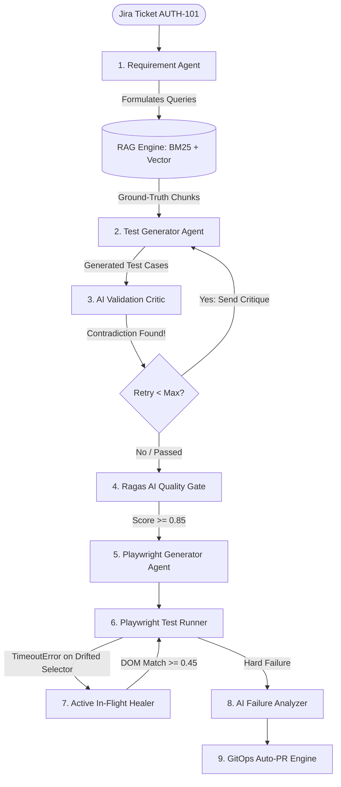

# High-Level Understanding: RAG vs Agents in Agentic Quality Engineering

## 1. Executive Summary: The Core Distinction

In an enterprise **Agentic Quality Engineering (QE) Platform**, beginners often confuse **RAG (Retrieval-Augmented Generation)** with **AI Agents**. They are not competitors—they are complementary halves of an intelligent system:

> **RAG is the *Knowledge & Memory* (What the system knows).**  
> It provides verified facts, corporate policies, security standards, and UI locator contracts from enterprise Confluence documents and existing codebase files.
>
> **Agents are the *Brain & Action* (What the system does).**  
> They reason over those facts, critique test designs, make decisions, execute browser tests in Playwright, self-heal broken selectors, and open GitOps Pull Requests.

```
┌────────────────────────────────────────────────────────────────────────────────────────┐
│                                   THE SYSTEM AT A GLANCE                               │
├──────────────────────────────────────────┬─────────────────────────────────────────────┤
│               RAG LAYER                  │                AGENTS LAYER                 │
│         (Retrieval & Memory)             │            (Reasoning & Action)             │
├──────────────────────────────────────────┼─────────────────────────────────────────────┤
│ • Ingests Confluence & Jira docs         │ • Analyzes requirements & acceptance criteria│
│ • Okapi BM25 keyword search              │ • Generates test scenarios (Positive/Neg/Sec)│
│ • Dense vector embeddings (FAISS/Pinecone│ • Audits coverage & catches contradictions  │
│ • Reciprocal Rank Fusion (RRF)           │ • Orchestrates cyclic self-healing loops    │
│ • Feeds authoritative facts to LLM       │ • Runs Playwright tests live in Chromium    │
│ • Indexed locator contracts & step defs  │ • Intercepts errors & heals locators live   │
│                                          │ • Classifies failures & opens GitOps PRs    │
│                                          │ • Evaluates Ragas mathematical Quality Gate │
└──────────────────────────────────────────┴─────────────────────────────────────────────┘
```

---

## 2. The Real-World Engineering Analogy

To explain this to an engineering manager, architect, or interviewer, use this analogy:

| Concept | Hospital Analogy | Software QA Analogy |
|:---|:---|:---|
| **RAG** | **The Medical Library & Patient Records**<br>Contains medical textbooks, drug dosage tables, hospital protocols, and patient history. It cannot perform surgery or diagnose patients; it only supplies accurate information when asked. | **The Confluence Knowledge Base & Corporate Guidelines**<br>Contains OWASP security guidelines, account lockout thresholds, UI locator standards (`data-testid`), and existing automation step definitions. It cannot write, run, or fix tests. |
| **Agents** | **The Medical Squad (Specialists, Surgeons, Nurses)**<br>The General Physician diagnoses, the Pharmacist double-checks drug interactions (Critique), the Surgeon operates (Action), and the ER nurse reacts to complications (Self-Healing). | **The Multi-Agent QE Squad**<br>The **Requirement Agent** interprets Jira, the **Test Gen Agent** drafts cases, the **Validation Critic** audits errors and rejects bad drafts, the **Playwright Agent** writes code, and the **In-Flight Healer** fixes broken DOM locators live in the browser. |

---

## 3. Why Neither RAG Alone Nor Agents Alone Is Sufficient

### The Failure of "RAG Only" (Naive RAG)
A traditional RAG pipeline is a **one-way, static prompt**:
1. User provides a query $\rightarrow$ RAG retrieves chunks $\rightarrow$ LLM generates an answer $\rightarrow$ Pipeline ends.
2. **Why it fails in QA**:
   - If the generated Playwright code contains a syntax error or hallucinated assertion, traditional RAG has no way to detect it.
   - It cannot execute the code in a browser.
   - It cannot observe a test failure and investigate the DOM.
   - It cannot loop back and correct its own mistakes.

### The Failure of "Agents Only" (Unbounded Agents)
An agent without RAG has only its pre-trained public internet weights:
1. **Why it fails in QA**:
   - It doesn't know your company's proprietary authentication error messages.
   - It doesn't know your frontend engineering team's agreed locator conventions (e.g. `data-testid="input-email"` vs `id="user_login"`).
   - It will hallucinate lockout thresholds (guessing 3 attempts when your Confluence policy strictly mandates 5).

---

## 4. Deep Dive: Exactly What RAG Does in this Platform

RAG acts as the **single source of truth** for all business rules, architecture constraints, and automation patterns.

### Step 1: Ingestion & Smart Chunking
- Ingests enterprise Confluence documentation:
  - [`auth_security_policy.md`](file:///d:/GEN_AI_Learning/Gen_Ai_job_prep/RAG/QE_Agentic_RAG/app/data/confluence_docs/auth_security_policy.md): OWASP ASVS 4.0, zero user enumeration, generic credential error formats.
  - [`account_lockout_rules.md`](file:///d:/GEN_AI_Learning/Gen_Ai_job_prep/RAG/QE_Agentic_RAG/app/data/confluence_docs/account_lockout_rules.md): Exactly 5 consecutive invalid login attempts within 15 minutes trigger account lockout.
  - [`ui_locator_standards.md`](file:///d:/GEN_AI_Learning/Gen_Ai_job_prep/RAG/QE_Agentic_RAG/app/data/confluence_docs/ui_locator_standards.md): Mandatory `data-testid` selector contract.
- Splits files using `RecursiveCharacterTextSplitter` respecting markdown header boundaries (`## `, `### `) so chunks retain section context.

### Step 2: Hybrid Retrieval (BM25 Sparse + Dense Vectors)
Enterprise technical documentation has exact tokens that pure semantic vector search frequently misses:
1. **Okapi BM25 Sparse Index**: Matches exact error codes (e.g. `ERR_AUTH_LOCKOUT_503`), regular expressions, and CSS selector tags.
2. **Dense Vector Embeddings (Pinecone / FAISS)**: Matches conceptual queries (e.g., searching "prevent brute force" matches "account lockout rules").
3. **Reciprocal Rank Fusion (RRF)**:
   $$RRF(d) = \sum_{r \in \text{retrievers}} \frac{1}{60 + \text{rank}_r(d)}$$
   Combines and re-ranks sparse and dense search candidates into a unified, high-confidence context payload.

### Step 3: Context Delivery
RAG injects this vetted policy snippet into the LLM's prompt context, transforming an ungrounded model into an enterprise-aware model.

---

## 5. Deep Dive: Exactly What AGENTS Do in this Platform

The platform organizes engineering tasks as a stateful, cyclic directed graph built with **LangGraph** ([`app/agents/graph.py`](file:///d:/GEN_AI_Learning/Gen_Ai_job_prep/RAG/QE_Agentic_RAG/app/agents/graph.py)).



### The 8 Specialized Agents:

| Agent | Source File | Exact Responsibility |
|:---|:---|:---|
| **1. Requirement Agent** | [`requirement_agent.py`](file:///d:/GEN_AI_Learning/Gen_Ai_job_prep/RAG/QE_Agentic_RAG/app/agents/requirement_agent.py) | Parses Jira tickets into discrete Acceptance Criteria ($AC_1 \dots AC_n$) and formulates precise search queries for the RAG retriever. |
| **2. Test Generator Agent** | [`test_gen_agent.py`](file:///d:/GEN_AI_Learning/Gen_Ai_job_prep/RAG/QE_Agentic_RAG/app/agents/test_gen_agent.py) | Synthesizes comprehensive test scenarios, classifying them into `Positive`, `Negative`, `Boundary`, and `Security` suites. Consumes feedback critiques from prior rejections. |
| **3. AI Validation Critic** | [`validation_agent.py`](file:///d:/GEN_AI_Learning/Gen_Ai_job_prep/RAG/QE_Agentic_RAG/app/agents/validation_agent.py) | Acts as an automated QA Lead. Computes acceptance criteria coverage score and audits for contradictions (e.g. catches a test asserting lockout at 3 attempts instead of 5). |
| **4. LangGraph Self-Healing Router** | [`graph.py`](file:///d:/GEN_AI_Learning/Gen_Ai_job_prep/RAG/QE_Agentic_RAG/app/agents/graph.py) | Cyclic conditional edge. If the Critic rejects the test plan, it loops back to `TestGenAgent` with detailed critique instructions until validation passes. |
| **5. Synthetic Data Agent** | [`synthetic_data_agent.py`](file:///d:/GEN_AI_Learning/Gen_Ai_job_prep/RAG/QE_Agentic_RAG/app/agents/synthetic_data_agent.py) | Autonomously creates 4 tiers of test fixtures: Happy Path, Boundary values (empty fields, unicode/emojis), Security Fuzz payloads (SQLi, XSS), and PII-pseudonymized test IDs. |
| **6. Playwright Generator Agent** | [`playwright_gen_agent.py`](file:///d:/GEN_AI_Learning/Gen_Ai_job_prep/RAG/QE_Agentic_RAG/app/agents/playwright_gen_agent.py) | Transforms validated test cases into production-grade Python Playwright code matching your framework: flat scripts, Page Object Model (POM), or `pytest-bdd` Gherkin features + step definitions. |
| **7. In-Flight Self-Healing Agent** | [`self_healer.py`](file:///d:/GEN_AI_Learning/Gen_Ai_job_prep/RAG/QE_Agentic_RAG/app/test_runner/self_healer.py) | Operates **live inside the active browser session**. Intercepts Playwright `TimeoutError`, analyzes active DOM candidates, scores them, swaps the locator on the fly, and lets the test pass. |
| **8. Failure Analyzer & GitOps Agent** | [`failure_analyzer_agent.py`](file:///d:/GEN_AI_Learning/Gen_Ai_job_prep/RAG/QE_Agentic_RAG/app/agents/failure_analyzer_agent.py) & [`patch_engine.py`](file:///d:/GEN_AI_Learning/Gen_Ai_job_prep/RAG/QE_Agentic_RAG/app/gitops/patch_engine.py) | Analyzes post-mortem pytest stack traces, classifies root cause (`LOCATOR_DRIFT` vs `APPLICATION_DEFECT`), validates fixes via Python AST (`ast.parse`), and opens a GitHub Pull Request with a unified diff. |

---

## 6. How RAG and Agents Collaborate: Turn-by-Turn Trace on `AUTH-101`

To visualize how they interact in practice, trace Jira ticket **AUTH-101** (*Customer Authentication & Account Security Lockout*):

```
Turn 1: Requirement Ingestion
Jira Ticket AUTH-101 arrives.
└── Requirement Agent parses 6 Acceptance Criteria.
    └── Formulates query: "Find account lockout thresholds, error messages, and UI locator standards."

Turn 2: RAG Knowledge Retrieval
RAG executes Hybrid Search (BM25 + FAISS Vector):
├── Sparse BM25 finds exact string: 'Account locked due to 5 failed attempts.'
├── Dense Vector finds policy: 'OWASP ASVS 4.0: Zero user enumeration.'
└── RAG returns 3 policy chunks to the Agent State.

Turn 3: Test Generation & Critic Review
Test Generator Agent drafts 6 test cases.
└── In TC006, it accidentally generates: "Assert lockout after 3 failed attempts."
└── AI Validation Critic audits the draft:
    ├── Coverage: 100% (all 6 ACs mapped).
    └── Contradiction: FAIL! AC6 and RAG chunk state 5 attempts, not 3.
    └── Verdict: REJECT. Feedback: "Correct lockout threshold in TC006 to exactly 5 attempts."

Turn 4: Self-Healing Loopback
LangGraph triggers conditional edge: routes back to Test Generator Agent.
└── Test Generator Agent reads Critic feedback and corrects TC006 to 5 attempts.
└── AI Validation Critic re-evaluates: PASS!

Turn 5: Ragas AI Quality Gate
Ragas Evaluator checks against Golden Dataset benchmark:
├── Context Precision: 0.88
├── Context Recall:    0.92
├── Faithfulness:       0.96 (all assertions grounded in RAG docs)
├── Answer Relevance:  0.93
└── Gate: PASSED (Average: 0.92 >= 0.85).

Turn 6: Code Generation & Execution
Playwright Generator Agent generates test_auth_101.py.
└── Pytest runner launches Chromium browser.
└── Browser executes all 6 tests against live enterprise portal: 6 PASSED in 0.8s!
```

---

## 7. Direct Side-by-Side Comparison Matrix

| Dimension | RAG (Retrieval-Augmented Generation) | Agents (Multi-Agent System) |
|:---|:---|:---|
| **Fundamental Nature** | Information Retrieval & Search Engine | Reasoning, Decision-Making & Execution Engine |
| **Statefulness** | Stateless (Input Query $\rightarrow$ Output Chunks) | Stateful (Tracks state, retries, counters, DOM history) |
| **Role in Platform** | Corporate Knowledge Base & Policy Repository | QA Team (Analyst, Generator, Critic, Coder, Healer) |
| **Input** | Semantic queries, error tokens, selector names | Jira stories, execution logs, browser DOM, stack traces |
| **Output** | Prioritized text snippets & policy excerpts | Test plans, Playwright scripts, PR diffs, Jira defects |
| **Can it loop/retry?** | No (Single retrieval pass) | Yes (LangGraph conditional feedback loop) |
| **Can it execute code?** | No | Yes (Runs Playwright tests in headless Chromium) |
| **Can it fix mistakes?** | No (Passively supplies whatever documents match) | Yes (AI Critic audits and triggers self-healing) |
| **Real-time reaction?** | No | Yes (In-flight healer intercepts live browser timeouts) |
| **Quality measurement** | Context Precision & Context Recall | Faithfulness, Test Pass Rate, Self-Healing Accuracy |

---

## 8. Summary for Interviews & Architecture Presentations

When asked in an interview:  
**"What is the difference between RAG and Agents in your project?"**

> *"In our platform, **RAG provides the corporate ground truth**, while the **Agents provide the intelligence and execution**.*  
> 
> *A Jira story only gives high-level user requirements. We use **Hybrid RAG (BM25 + Dense embeddings fused via RRF)** to pull in internal Confluence technical standards—such as exact OWASP generic error messages, UI locator contracts, and account lockout thresholds. This eliminates hallucinations.*  
> 
> *Our **Multi-Agent system (built on LangGraph)** then acts on that knowledge. One agent drafts the test cases, another agent acts as an AI Critic to audit for contradictions and enforce a self-healing loop, a code-generation agent writes Playwright tests matching existing framework conventions (POM or pytest-bdd), and an in-flight healing agent dynamically rescues broken selectors live in the browser. RAG is our library; the Agents are our autonomous engineering team."*

---

## 9. Performance Math: Scaling the Pipeline to 350 Golden Records

When asked: **"How much time will it take to run the entire RAG pipeline if your golden dataset has 350 records?"**

```
                     PER-RECORD LATENCY BREAKDOWN (~7.0s TOTAL)
  ┌───────────────────────┬───────────────────────────────┬───────────────────────────┐
  │ Hybrid Retrieval      │ Agent Generation & Validation │ Ragas Quality Gate Eval   │
  │ BM25 + FAISS (30-50ms)│ TestGen + Critic Loop (2.5s)  │ 4 Metrics Judge (4.0s)    │
  └───────────────────────┴───────────────────────────────┴───────────────────────────┘
```

### The Architectural Math:
1. **Naive Sequential (Anti-Pattern)**:
   $$350 \text{ records} \times 7\text{s} = 2,450\text{s} \approx \mathbf{40.8\text{ minutes}} \quad \text{(Fails CI/CD SLA!)}$$
2. **Async Concurrency with Rate-Limited Worker Pool ($N=25$)**:
   $$\text{Wall-Clock Time} = \frac{350 \times 7\text{s}}{25} \approx 98\text{s} \approx \mathbf{1.6 \text{ to } 2.5\text{ minutes}}$$
   - Uses `asyncio.Semaphore(25)` respecting enterprise RPM/TPM quotas.
   - **Throughput**: ~140 evaluated user stories / minute.
3. **Prompt Prefix Caching**:
   - Because system prompts and Confluence policy chunks are identical across runs, caching cuts TTFT by **60%**, dropping generation time to ~1.2s.
4. **Tiered CI/CD Execution**:
   - **PR Pull Request Gate**: Evaluates a **stratified sample of 25 critical records** in **~17 seconds**.
   - **Nightly Regression Suite**: Evaluates all **350 records** in **~2.5 minutes**.
5. **Token Cost Economics for 350 Records**:
   - 350 records $\times$ 3,300 tokens $\approx$ **1.15 Million tokens**.
   - **Tier 1 (GPT-4o-mini / Gemini Flash)**: $\mathbf{\$0.17}$ (17 cents for the entire run!).
   - **Tier 2 (GPT-4o)**: $\approx \mathbf{\$4.60}$.
